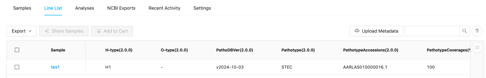
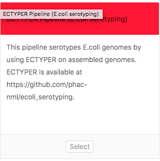

# IRIDA ecTyper Plugin for E.coli serotyping
This new IRIDA plugin allows deploying ECTyper, a tool for *in silico* E.coli typing in IRIDA platform (https://github.com/phac-nml/irida).

The ECTYPER IRIDA plugin *in silico* serotypes, pathotypes and detects Shiga toxins in *E.coli* samples from short paired Illumina reads. In addition, the plugin performs species check to discriminate other non-E.coli samples. It can effectively discriminate between *E.coli* and *Shigella* spp. and *E.albertii*.

This tool is readily installable by the placement of the `*.jar` file (see releases section) in `/etc/irida/plugins` directory and installation of [the dependencies](#dependencies) in the Galaxy server. After IRIDA webserver restart, the new pipeline should appear. 


# Features
New to version `2.0.0`

* Improved species identification module thanks to custom species sketch and [GTDB database](https://gtdb.ecogenomic.org/)
* Pathotyping of E.coli
* Shiga toxin subtyping including multiple copies per sample
* Detection of  enterohemolysin A `ehxA` gene
* Other minor improvements including support for compressed `gz` files
* Almost all ECTYPER report fields are reported and more simpler field update code structure for simpler code new fields addition and updates


# Building plugin

Building and packaging this code is accomplished using [Apache Maven](http://maven.apache.org/download.cgi) with version >3.6.3. However, you will first need to install [IRIDA](https://github.com/phac-nml/irida) to your local Maven repository via `mvn install -DskipTests` command. The version of IRIDA you install will have to correspond to the version found in the `irida.version.compiletime` property in the [pom.xml](https://github.com/phac-nml/irida-plugin-ectyper/blob/master/pom.xml) file of this project. Right now, the recommended version to compile plugin is IRIDA version `22.05`. To build successfully plugin there is a need to compile IRIDA corresponding to the version specified in the `pom.xml` file. 

Here is a brief workflow to compile new `*.jar` file from the source code 

```bash
IRIDA_VERSION=19.01.3
# Build IRIDA dependencies
git clone https://github.com/phac-nml/irida.git
git checkout ${IRIDA_VERSION}
#IRIDA dependencies will be located in ~/.m2
mvn install -DskipTests 
git clone https://github.com/phac-nml/irida-plugin-ectyper.git
cd irida-plugin-ectyper
# Build ECTyper plugin
mvn package -DskipTests  #find your package in /target
# move to *.jar to /etc/irida/plugins/
```
Below you will find more detailed explanations of each step above.


# Dependencies

The following dependencies are required in order to make use of this plugin.

* IRIDA >= 19.01.3
* Java == 11 and Maven >= 3.6.3 (for building dependencies)
* Galaxy >= 16.01
* Shovill == 1.0.4
* ECTYPER == 2.0.0

# Galaxy configuration
The plugin assumes a properly configured Galaxy instance that will run the workflow included in the plugin.
For this version of the plugin, the backend Galaxy instance needs to have the following tools installed via the Admin interface.

* Shovill v1.0.4
  * version 1.0.4
  * revision 3:865119fcb694
  * published 2018-11-13
  * [ToolShed direct link](https://toolshed.g2.bx.psu.edu/view/iuc/shovill/865119fcb694)

  
* ECTyper v2.0.0
  * version 2.0.0
  * revision 6:9cd096bee567
  * published 2024-12-30
  * [ToolShed direct link](https://toolshed.g2.bx.psu.edu/view/nml/ectyper/9cd096bee567)

# Gallery
A couple of illustrations demonstrating plugin in action.

### Automatic metadata population
The plugin allows for automatic IRIDA project metadata population. E.g. sample15 typing shows species, QC flag, antigen gene scores and other features.



After successfull installation, plugin should appear in list of available pipilines. If not, check web-server log files for errors (e.g. Tomcat 7 logs `/var/log/tomcat7/catalina.out`)

<p align="center">
  
</p>


