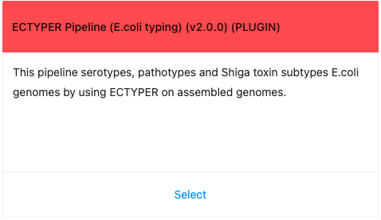

# IRIDA ecTyper Plugin for E.coli serotyping
This new IRIDA plugin allows deploying ecTyper, a tool for in silico E.coli serotyping, in IRIDA platform.

The tool can not only in silico sertypes E.coli samples, but also discriminates other non-E.coli samples. It can effectively discriminate between E.coli and Shigella and E.albertii.
This tool is readily installable by the placement of the `*.jar` file (see releases section) in `/etc/irida/plugins` directory. After IRIDA webserver restart, the new pipeline should appear. 

# Features
New to version 1.0.0 incorporates

* Quality Control module for easier assesement of results reliability and the need of any further wet-lab followup for reporting purposes
* Automatic project metadata population for easier download and pulling via API or as a tab-delimited file
* Automatic assembly of paired reads (Illumina platform for now) and typing. Platform indendent version could be implmented by workflow update
* New report with information on `%identity`, `%coverage`, more detailed quality control flags and database version
* Other minor improvements


# Building plugin

Building and packaging this code is accomplished using [Apache Maven](http://maven.apache.org/download.cgi). However, you will first need to install [IRIDA](https://github.com/phac-nml/irida) to your local Maven repository. The version of IRIDA you install will have to correspond to the version found in the `irida.version.compiletime` property in the [pom.xml](https://github.com/phac-nml/irida-plugin-ectyper/blob/master/pom.xml) file of this project. Right now, this is IRIDA version `19.01.3`. To build successfully plugin there is a need to compile IRIDA corresponding to the version specified in `pom.xml`. 
Here is a brief workflow to compile new `*.jar` file from the source code 

```bash
# Build IRIDA dependencies
git clone https://github.com/phac-nml/irida.git
git checkout 19.01.3
#IRIDA dependencies will be located in ~/.m2
mvn install -DskipTests 
git clone https://github.com/phac-nml/irida-plugin-ectyper.git
cd irida-plugin-ectyper
# Build ECTyper plugin
mvn package -DskipTests  #find your package in /target
# move to *.jar to /etc/irida/plugins/
```
Below you will find more detailed explanations of each step above.


# Dependencies

The following dependencies are required in order to make use of this plugin.

* IRIDA >= 19.01.3
* Java >= 1.8 and Maven >= 3.3.9 (for building dependencies)
* Galaxy >= 16.01
* Shovill == 1.0.4
* ECTYPER == 1.0.0

# Galaxy configuration
The plugin assumes a properly configured Galaxy instance that will run the workflow included in the plugin.
For this version of the plugin, the backend Galaxy instance needs to have the following tools installed via the Admin interface.

* Shovill v1.0.4
  * version 1.0.4
  * revision 3:865119fcb694
  * published 2018-11-13
  * [ToolShed direct link](https://toolshed.g2.bx.psu.edu/view/iuc/shovill/865119fcb694)

  
* ECTyper v1.0.0
  * version 1.0.0
  * revision 4:08d801182fa1
  * published 2020-05-29
  * [ToolShed direct link](https://toolshed.g2.bx.psu.edu/view/nml/ectyper/08d801182fa1)

# Gallery
A couple of illustrations demonstrating plugin in action.

### Automatic metadata population
The plugin allows for automatic IRIDA project metadata population. E.g. sample15 typing shows species, database version, QC flag and antigen gene scores.


After successfull installation, plugin should appear in list of available pipilines. If not, check web-server log files for errors (e.g. Tomcat 7 logs `/var/log/tomcat7/catalina.out`)



